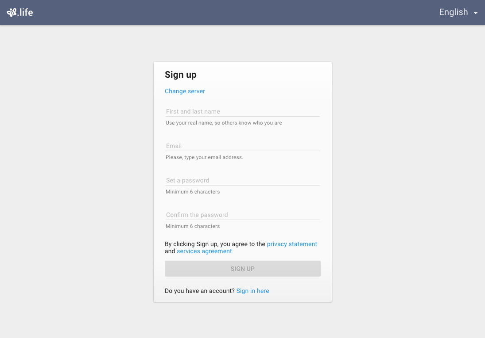
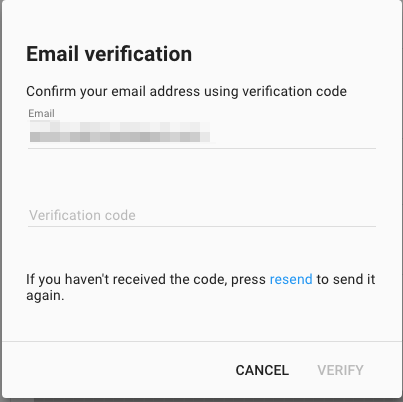

#    User entry pages

Most Line-of-Business applications tailor information to specific user. To do that, they have to identify who the user is.
It is also need to support registrations for new users, let them recover their passwords and so on.
Pip.WebUI.Entry module supports user registration and entry process. It contains implementation of signin, signup, password recovery and email verification views implemented as pages, dialogs and panels.

The module relies on the standard REST API for **users** and **sessions** implemented on the server.

### Signin

Signin form provides fields to use authorization via user name/password. Within typing data into input fields it is validated
in realtime. Also, user can change signin server.
Checkbox `Remember` lets prolong login session even after some work breaking with service.

### Signup

Signup form lets newcomer create an account for using provided service. Form has validated fields. Under each input fields
are located errors notifications. Also, user can choose signup server.

### Post-signup

'Post signup' page is appears after success creating user account. The form includes controls which let point out basic
 information about user (brief description, birthday, avatar image) and choose application interface language.

### Password recovery

'Password recover' page allows user to recover forgotten password by sending email with instructions how to do. User
can choose authorization server. Validation on input field is supported and if it necessary will notify user about error.

### Email verification

'Email verification' page allows user to change user's contact email established before. User point out control email
 where will be send verification code to insert the one into the second pane field. Input fields have validation notifications.

### Changing password

'Change password' page allows user to change user's account password. All input fields support validation and error notification
 under each one.

### pipEntry provider

**pipEntry** provider allows to configure look and behavior of entry pages.

Todo: Add code snippet to demonstrate how to configure entry pages

## Learn more about the module

- [User's guide](doc/UsersGuide.md)
- [Online samples](http://webui.pipdevs.com/pip-webui-entry/index.html)
- [API reference](http://webui-api.pipdevs.com/pip-webui-entry/index.html)
- [Developer's guide](doc/DevelopersGuide.md)
- [Changelog](CHANGELOG.md)
- [Pip.WebUI project website](http://www.pipwebui.org)
- [Pip.WebUI project wiki](https://github.com/pip-webui/pip-webui/wiki)
- [Pip.WebUI discussion forum](https://groups.google.com/forum/#!forum/pip-webui)
- [Pip.WebUI team blog](https://pip-webui.blogspot.com/)

## Module dependencies

* [pip-webui-lib](https://github.com/pip-webui/pip-webui-lib): angular, angular material and other 3rd party libraries
* [pip-webui-css](https://github.com/pip-webui/pip-webui-css): CSS styles and web components
* [pip-webui-core](https://github.com/pip-webui/pip-webui-core): localization and other core services
* [pip-webui-rest](https://github.com/pip-webui/pip-webui-rest): REST resources for users, files and sessions
* [pip-webui-controls](https://github.com/pip-webui/pip-webui-controls): date and time controls for post-signup
* [pip-webui-layouts](https://github.com/pip-webui/pip-webui-layouts): document, card and dialog layout
* [pip-webui-locations](https://github.com/pip-webui/pip-webui-locations): location control to show current user location in post-signup
* [pip-webui-pictures](https://github.com/pip-webui/pip-webui-pictures): user avatar control

## License

This module is released under [MIT license](License) and totally free for commercial and non-commercial use.
