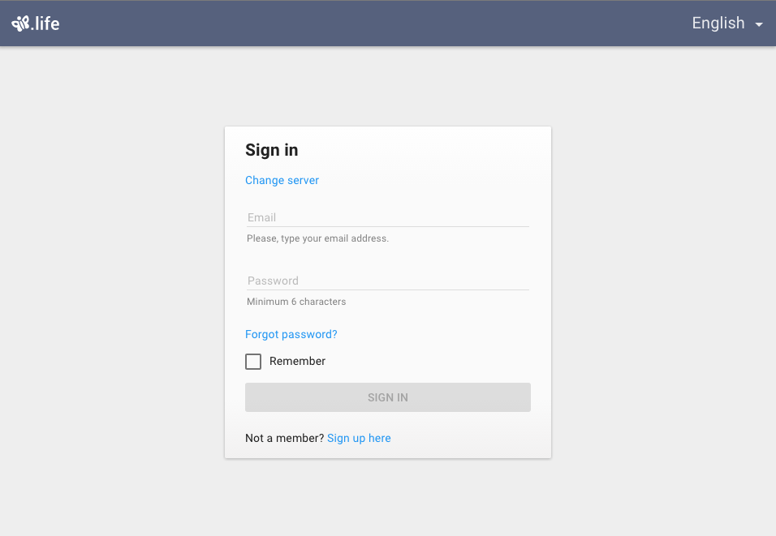

# Pip.WebUI Entry

Entry Web UI component is a sub-module of Pip.Services platform and can be used in applications
based on the platform.

This module provides next functionality:

* **Signin** page for user's signin process
* **Signup** and **post signup** pages
* **Password reset** and **password recovery** pages
* **Email validation**

This module implements internationalization language support.

All implemented pages are cooperates with `pipAppBar` [component](http://link-to-pipAppBar.com)

In the version 1.0.0 the implementation was cleaned up and covered with unit tests.
Implementation became fully portable across browser and devices.


### The complete library

 * [https://github.com/pip-webui/pip-webui](https://github.com/pip-webui/pip-webui)

## Demos

[Examples Online](http://webui.pipdevs.com/pip-webui-entry/index.html)


## Quick links

* [Module dependencies](#dependencies)
* [Components](#components)
  - ['Signin' page](#signin)
  - ['Signup' page](#signup)
  - ['Post signup' page](#post_signup)
  - ['Password recover' page](#password_recover)
  - ['Email Verification' page](#email_verification)
  - ['Change Password' page](#password_change)
* [Browsers compatibility](#compatibility)
* [Community](#community)
* [Contributing](#contributing)
* [Build](#build)
* [License](#license)


## <a name="dependencies"></a>Module dependencies

* <a href="https://github.com/pip-webui/pip-webui-tasks">pip-webui-tasks</a> - Helpful tasks for development
* <a href="https://github.com/pip-webui/pip-webui-lib">pip-webui-lib</a> - Vendor libraries
* <a href="https://github.com/pip-webui/pip-webui-css">pip-webui-css</a> - CSS Framework
* <a href="https://github.com/pip-webui/pip-webui-core">pip-webui-core</a> - Core platform module
* <a href="https://github.com/pip-webui/pip-webui-rest">pip-webui-rest</a> - REST API module
* <a href="https://github.com/pip-webui/pip-webui-controls">pip-webui-controls</a> - Assets of control components
* <a href="https://github.com/pip-webui/pip-webui-layouts">pip-webui-layouts</a> - Document layouts
* <a href="https://github.com/pip-webui/pip-webui-nav">pip-webui-nav</a> - All-sufficient UI navigation components
* <a href="https://github.com/pip-webui/pip-webui-locations">pip-webui-locations</a> - UI components to define and show users location
* <a href="https://github.com/pip-webui/pip-webui-pictures">pip-webui-pictures</a> - UI picture components
* <a href="https://github.com/pip-webui/pip-webui-entry">pip-webui-entry</a> - All-sufficient UI component for any authenticate states
* <a href="https://github.com/pip-webui/pip-webui-test">pip-webui-test</a> - Provides mocked data needed for unit testing


## <a name="components"></a>Module components

### <a name="signin"></a>'Signin' page
<a href="doc/images/img-signin.png" style="border: 3px ridge #c8d2df; width: 50%; margin: auto; display: block">
    
</a>

Signin form provides fields to use authorization via user name/password. Within typing data into input fields it is validated
in realtime. Also, user can change signin server.
Checkbox `Remember` lets prolong login session even after some work breaking with service.

[Online Example](http://webui.pipdevs.com/pip-webui-entry/index.html#/signin)

<br/>

### <a name="signup"></a>'Signup' page
<a href="doc/images/img-signup.png" style="border: 3px ridge #c8d2df; width: 50%; margin: auto; display: block">
    
</a>

Signup form lets newcomer create an account for using provided service. Form has validated fields. Under each input fields
are located errors notifications. Also, user can choose signup server.

[Online Example](http://webui.pipdevs.com/pip-webui-entry/index.html#/signup?server_url=http:%252F%252Falpha.pipservices.net)

<br/>


### <a name="post_signup"></a>'Post signup' page
<a href="doc/images/img-post-signup.png" style="border: 3px ridge #c8d2df; width: 50%; margin: auto; display: block">
    
</a>

'Post signup' page is appears after success creating user account. The form includes controls which let point out basic
 information about user (brief description, birthday, avatar image) and choose application interface language.

[Online Example](http://webui.pipdevs.com/pip-webui-entry/index.html#/signup?server_url=http:%252F%252Falpha.pipservices.net)

<br/>

### <a name="password_recover"></a>'Password recover' page
<a href="doc/images/img-recover-password.png" style="border: 3px ridge #c8d2df; width: 50%; margin: auto; display: block">
    
</a>

'Password recover' page allows user to recover forgotten password by sending email with instructions how to do. User
can choose authorization server. Validation on input field is supported and if it necessary will notify user about error.

[Online Example](http://localhost:8009/samples/index.html#/recover_password?server_url=http:%252F%252Falpha.pipservices.net)


<br/>

### <a name="email_verification"></a>'Email verification' page
<a href="doc/images/img-email-verification.png" style="border: 3px ridge #c8d2df; width: 50%; margin: auto; display: block">
    
</a>

'Email verification' page allows user to change user's contact email established before. User point out control email
 where will be send verification code to insert the one into the second pane field. Input fields have validation notifications.

[Online Example](http://localhost:8009/samples/index.html#/recover_password?server_url=http:%252F%252Falpha.pipservices.net)

<br/>

### <a name="password_change"></a>'Change password' page
<a href="doc/images/img-change-password.png" style="border: 3px ridge #c8d2df; width: 50%; margin: auto; display: block">
    
</a>

'Change password' page allows user to change user's account password. All input fields support validation and error notification
 under each one.

[Online Example](http://localhost:8009/samples/index.html#/recover_password?server_url=http:%252F%252Falpha.pipservices.net)


## <a name="compatibility"></a>Compatibility

PIP.WEBUI has been thoroughly tested against all major browsers and supports:

 * IE11+,
 * Edge
 * Chrome 47+,
 * Firefox 43
 * Opera 35

## <a name="community"></a>Community

* Follow [@pip.webui on Twitter](http://link.com)
* Subscribe to the [PIP.WebUI Newsletter](http://link.com)
* Have a question that's not a feature request or bug report? Discuss on the [PIP Forum](https://groups.google.com/forum/#!forum/pipdevs)
* Have a feature request or find a bug? [Submit an issue](http://link.com)
* Join our Community Slack Group! [PIP Worldwide](http://link.com)


## <a name="contributing"></a>Contributing

Developers interested in contributing should read the following guidelines:

* [Issue Guidelines](http://somelink.com)
* [Contributing Guidelines](http://somelink.com)
* [Coding guidelines](http://somelink.com)

> Please do **not** ask general questions in an issue. Issues are only to report bugs, request
  enhancements, or request new features. For general questions and discussions, use the
  [Pip Devs Forum](https://groups.google.com/forum/#!forum/pipdevs).

It is important to note that for each release, the [ChangeLog](CHANGELOG.md) is a resource that will
itemize all:

- Bug Fixes
- New Features
- Breaking Changes

## <a name="build"></a>Build

Projects environment deploy is occurred using npm and gulp.

First install or update your local project's **npm** tools:

```bash
# First install all the NPM tools:
npm install

# Or update
npm update
```

Then run the **gulp** tasks:

```bash
# To clean '/build' and '/dist' directories
gulp clean

# To build distribution files in the `/dist` directory
gulp build

# To launch samples (build will open samples/index page in web browser)
gulp launch
```

For more details on how the build process works and additional commands (available for testing and
debugging) developers should read the [Build Instructions](docs/guides/BUILD.md).


## <a name="license"></a>License

PIP.WebUI is under [MIT licensed](LICENSE).

