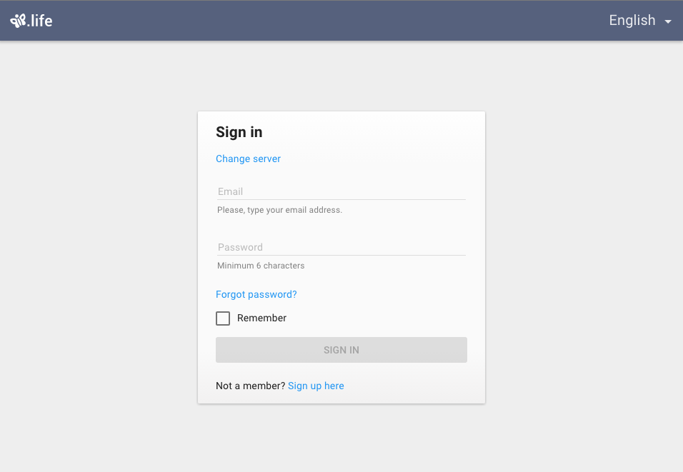
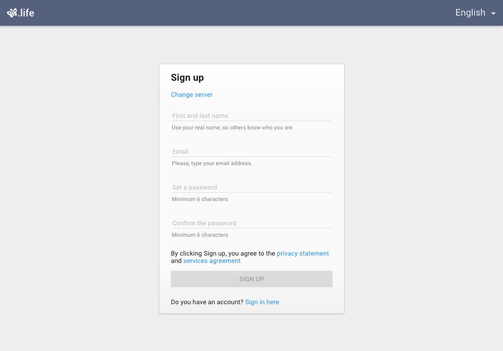
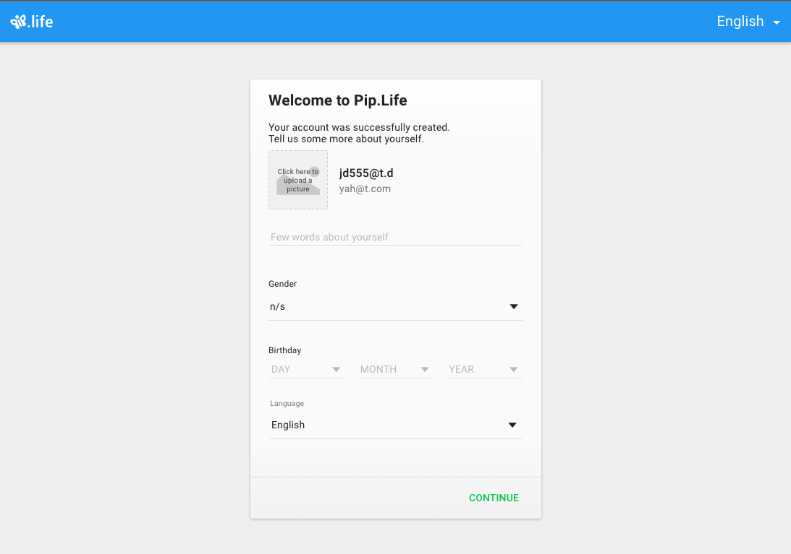
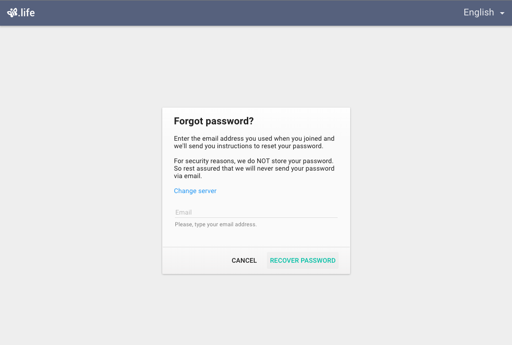
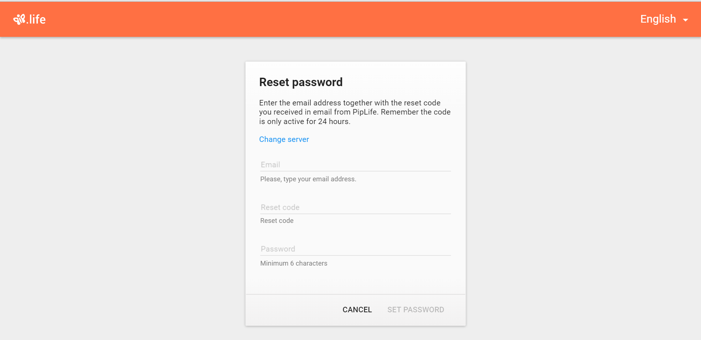

# Pip.WebUI.Entry User's Guide

## <a name="contents"></a> Contents
- [Installing](#install)
- [pipEntry provider](#entry_provider)
- [Signin page](#signin_page)
- [pipSigninDialog](#signin_dialog)
- [pip-signin-panel](#signin_panel)
- [Signup page](#signup_page)
- [pipSignupDialog](#signup_dialog)
- [pip-signup-panel](#signup_panel)
- [Post-signup page](#post_signup_page)
- [pipPostSignupDialog](#post_signup_dialog)
- [pip-post-signup-panel](#post_signup_panel)
- [Recover password page](#recover_password_page)
- [pipRecoverPasswordDialog](#recover_password_dialog)
- [pip-recover-password-panel](#recover_password_panel)
- [Reset password page](#reset_password_page)
- [pipResetPasswordDialog](#reset_password_dialog)
- [pip-reset-password-panel](#reset_password_panel)
- [Verify email page](#verify_email_page)
- [Questions and bugs](#issues)


## <a name="install"></a> Installing

Add dependency to **pip-webui** into your **bower.json** or **package.json** file depending what you use.
```javascript
"dependencies": {
  ...
  "pip-webui": "*"
  ...
}
```

Alternatively you can install **pip-webui** manually using **bower**:
```bash
bower install pip-webui
```

or install it using **npm**:
```bash
npm install pip-webui
```

Include **pip-webui** files into your web application.
```html
<link rel="stylesheet" href=".../pip-webui-lib.min.css"/>
<link rel="stylesheet" href=".../pip-webui.min.css"/>
...
<script src=".../pip-webui-lib.min.js"></script>
<script src=".../pip-webui.min.js"></script>
```

Register **pipEntry** module in angular module dependencies.
```javascript
angular.module('myApp',[..., 'pipEntry']);
```

## <a name="entry_provider"></a> pipEntry provider

**pipEntry** provider allows to configure behavior and look in entry pages during configure phase.

### Usage
Todo: Add code snippet to demonstrate how to configure entry page 
(сейчас так все реализовано что не нужно настраивать EntryProvider)

```javascript
pipRestProvider.serverUrl('http://alpha.pipservices.net');

pipAuthStateProvider.unauthorizedState('signin');
pipAuthStateProvider.authorizedState('about_me');
```

### Methods

* **adminOnly(newValue: bool): bool** - sets requirement for users to have administrative role to enter the application.
  - Params:
    + newValue - **true** to retrict access to admins, **false** to allow access to all types of users, **null** to keep the current setting
  - Returns: the currently set setting

* **fixedServerUrl(newUrl: string): string** - sets fixed server url. If the url is set, all entry forms hide server URL combobox and allow connection only the the fixed server. Otherwise, user can change the server he is connecting to. This setting is useful for testing to switch between servers with one application instance.
  - Params:
    + newUrl - the fixed server url to be set. **null** makes no changes
  - Returns: the currently selected fixed server url
  
## <a name="signin_page"></a> Signin page

**Signin** page allows to authenticate user using login and password. In the future we are going to add authentication with OAuth2 using popular providers like Google, Facebook or Twitter. 

The form depends on **signin** operation in REST API.
[Go to Pip.WebUI.Rest Users's Guide](https://github.com/pip-webui/pip-webui-rest/blob/master/doc/UsersGuide.md)

Navigation to the **Signin** page can be done using **signin** state or **#/signin** route. It takes an optional parameter to redirect after successful signin.

Server URL can be hidden by setting **fixedServerUrl** in **pipEntry** provider. **adminOnly** setting in **pipEntry** allows to restrict signins only to users with admin roles. It also hides links to signup since new users do not get admin privileges by default.

### Usage
Yon can go in html
```html
<md-button href="#/signin">Sign In</md-button>
```
or in js
```javascript
$state.go('signin', {});
```




## <a name="signin_dialog"></a> pipSigninDialog

**pipSigninDialog** provides the same signin form as **Signin** page, but it shows it as a dialog. 

### Usage
```javascript
thisModule.controller('customController', function (pipSigninDialog) {
    pipSigninDialog.show({});
)}
```

### Methods
* **show(params: any, successCallback, cancelCallback): void** - shows the dialog
  - Params:
    + params - dialog parameters
    + successCallback - callback function that is called when user is successfuly authenticated
    + cancelCallback - callback function that is called when user cancels the dialog


## <a name="signin_panel"></a> pip-signin-panel

**pip-signin-panel** provides the same signin form as **Signin** page, but it shows it as a panel, that can be placed on any custom form.

### Usage
```html
<pip-signin-panel pip-goto-signup-dialog="pipGotoSignupDialog"
                  pip-goto-recover-password-dialog="pipGotoRecoverPasswordDialog">
</pip-signin-panel>
```

### Attributes

* **pip-goto-signup-page** - function for routing on sign up page 
* **pip-goto-signup-dialog** - function for routing on sign up dialog
* **pip-goto-recover-password-dialog** -  function for routing on recover password dialog

## <a name="signup_page"></a> Signup page

**Signup** form allows users to register their account in application. The form is intentionally made ultra-short to low the barrier to entry for new users. Additional information can be entered in optional **Post-signup** form.

The form depends on **signup** operation in REST API.
[Go to Pip.WebUI.Rest Users's Guide](https://github.com/pip-webui/pip-webui-rest/blob/master/doc/UsersGuide.md)

Navigation to the **Signup** page can be done using **signup** state or **#/signup** route. It takes an optional parameter to redirect after successful signup.

Server URL can be hidden by setting **fixedServerUrl** in **pipEntry** provider.

### Usage
You can go in html
```html
<md-button href="#/signup">Sign Up</md-button>
```
or in js
```javascript
$state.go('signup', {});
```




## <a name="signup_dialog"></a> pipSignupDialog

**pipSignupDialog** provides the same signup form as **Signup** page, but it shows it as a dialog. 

### Usage
```javascript
thisModule.controller('customController', function (pipSignupDialog) {
    pipSignupDialog.show({});
)}
```

### Methods
* **show(params: any, successCallback, cancelCallback): void** - shows the dialog
  - Params:
    + params - dialog parameters
    + successCallback - callback function that is called when user is successfuly registered
    + cancelCallback - callback function that is called when user cancels the dialog


## <a name="signup_panel"></a> pip-signup-panel

**pip-signup-panel** provides the same signup form as **Signup** page, but it shows it as a panel, that can be placed on any custom form.

### Usage
```html
<pip-signup-panel pip-goto-signin-dialog="pipGotoSigninDialog"
                  pip-post-signup="pipPostSignup">
</pip-signup-panel>
```

### Attributes

* **pip-post-signup** - function for routing on post sign up state
* **pip-goto-signin-page** - function for routing on sign in page
* **pip-goto-signin-dialog** -  function for routing on sign in dialog

## <a name="post_signup_page"></a> Post-signup page

**Post signup** form can be opened right after signup to ask user to enter additional information: date of birth, avatar, location, pick preferred color theme.

The form depends on **users** and **files** operations in REST API.
[Go to Pip.WebUI.Rest Users's Guide](https://github.com/pip-webui/pip-webui-rest/blob/master/doc/UsersGuide.md)

Navigation to the **Post-signup** page can be done using **post_signup** state or **#/post_signup** route. It takes an optional parameter to redirect after successful signup.

### Usage
You can go in html
```html
<md-button href="#/post_signup?party_id='id'">Post Sign Up</md-button>
```
or in js
```javascript
$state.go('post_signup', { party_id='id' })
```




## <a name="post_signup_dialog"></a> pipPostSignupDialog

**pipPostSignupDialog** provides the same post-signup form as **Post-signup** page, but it shows it as a dialog. 

### Usage
```javascript
thisModule.controller('customController', function (pipPostSignupDialog) {
   function pipPostSignup(user){
       pipPostSignupDialog.show({ 
            $party:user
       });
   }
)}
```

### Methods
* **show(params: any, successCallback, cancelCallback): void** - shows the dialog
  - Params:
    + params - dialog parameters
    + successCallback - callback function that is called when post signup was successfully completed
    + cancelCallback - callback function that is called when user skips the dialog


## <a name="post_signup_panel"></a> pip-pos-signup-panel

**pip-post-signup-panel** provides the same pos-signup form as **Post-signup** page, but it shows it as a panel, that can be placed on any custom form.

### Usage
```html
<pip-post-signup-panel pip-data="data"
                       pip-created="$panel = $control"
                       pip-party="$party">
</pip-post-signup-panel>
```

### Attributes
* **pip-data** - object for updating
* **pip-created** - object with onPostSignupSubmit function
* **pip-party** - party object


## <a name="recover_password_page"></a> Recover password page

**Recover password** form lets users to recover their forgotten passwords by sending email with reset instructions. After submit, user is transfered to "Reset password** form where he can enter received code and set a new password.

The form depends on **recover_password** operation in REST API.
[Go to Pip.WebUI.Rest Users's Guide](https://github.com/pip-webui/pip-webui-rest/blob/master/doc/UsersGuide.md)

Navigation to the **Recover password** page can be done using **recover_password** state or **#/recover_password** route. 

Server URL can be hidden by setting **fixedServerUrl** in **pipEntry** provider.

### Usage
Yon can go in html
```html
<md-button href="#/recover_password">Recover password</md-button>
```
or in js
```javascript
$state.go('recover_password', { server_url:'url', email:'email@email.com'})
```




## <a name="recover_password_dialog"></a> pipRecoverPasswordDialog

**pipRecoverPasswordDialog** provides the same recover password form as **Recover password** page, but it shows it as a dialog. 

### Usage
```javascript
thisModule.controller('customController', function (pipRecoverPasswordDialog) {
   pipRecoverPasswordDialog.show({});
)}
```

### Methods
* **show(params: any, successCallback, cancelCallback): void** - shows the dialog
  - Params:
    + params - dialog parameters
    + successCallback - callback function that is called when password recover was successfully initiated
    + cancelCallback - callback function that is called when user cancels the dialog


## <a name="recover_password_panel"></a> pip-recover-password-panel

**pip-recover-password-panel** provides the same recover password form as **Recover password** page, but it shows it as a panel, that can be placed on any custom form.

### Usage
```html
<pip-recover-password-panel pip-data="data"
                pip-created="$panel = $control"
                pip-goto-reset="pipGotoReset">
</pip-recover-password-panel>
```

### Attributes

* **pip-data** - party object
* **pip-created** - object with onRecover function
* **pip-goto-reset** - function for routing on reset state

## <a name="reset_password_page"></a> Reset password page

**Reset password** form is opened right after **Recover password**. It allows to enter a new password after providing a valid reset code.

The form depends on **reset_password** operation in REST API.
[Go to Pip.WebUI.Rest Users's Guide](https://github.com/pip-webui/pip-webui-rest/blob/master/doc/UsersGuide.md)

Navigation to the **Reset password** page can be done using **reset_password** state or **#/reset_password** route. 

Server URL can be hidden by setting **fixedServerUrl** in **pipEntry** provider.

### Usage
Yon can go in html
```html
<md-button href="#/reset_password?server_url='url'&email='email@email.com'&code='123'">Reset password</md-button>
```
or in js
```javascript
$state.go('reset_password', { server_url:'url', email:'email@email.com', code:'123'})
```



## <a name="reset_password_dialog"></a> pipResetPasswordDialog

**pipResetPasswordDialog** provides the same reset password form as **Reset password** page, but it shows it as a dialog. 

### Usage
```javascript
thisModule.controller('customController', function (pipResetPasswordDialog) {
   pipResetPasswordDialog.show({});
)}
```

### Methods
* **show(params: any, successCallback, cancelCallback): void** - shows the dialog
  - Params:
    + params - dialog parameters
    + successCallback - callback function that is called when password was successfully reset
    + cancelCallback - callback function that is called when user cancels the dialog


## <a name="reset_password_panel"></a> pip-reset-password-panel

**pip-reset-password-panel** provides the same reset password form as **Reset password** page, but it shows it as a panel, that can be placed on any custom form.

### Usage
```html
<pip-reset-password-panel pip-data="data"
                          pip-created="$panel = $control">
</pip-reset-password-panel>
```

### Attributes

* **pip-data** - party object
* **pip-created** - object with onReset function

## <a name="verify_email_page"></a>Verify email page

**Verify email** form allows users to confirm their primary email addresses by entering verification code they shall receive via email right after registration. This form is usually opened using a link in the email with the code. For that reason it doesn't come as dialogs or panels (shall we add that?). After successful verification it switches to **Verify success** form. Form their user can continue using the application.

The form depends on **verify_email** operation in REST API.
[Go to Pip.WebUI.Rest Users's Guide](https://github.com/pip-webui/pip-webui-rest/blob/master/doc/UsersGuide.md)

Navigation to the **Verify email** page can be done using **verify** state or **#/reset_password** route. 

Server URL can be hidden by setting **fixedServerUrl** in **pipEntry** provider.

### Usage
Yon can go in html
```html
<md-button href="#/verify_email?server_url='url'&email='email@email.com'&code='123'">Reset password</md-button>
```
or in js
```javascript
$state.go('verify_email', { server_url:'url', email:'email@email.com', code='123'});
```


## <a name="issues"></a> Questions and bugs

If you have any questions regarding the module, you can ask them using our 
[discussion forum](https://groups.google.com/forum/#!forum/pip-webui).

Bugs related to this module can be reported using [github issues](https://github.com/pip-webui/pip-webui-entry/issues).
